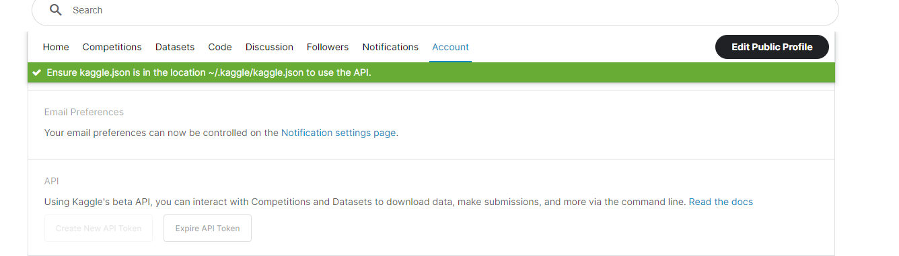

# **Data pipeline for Video Game Sales monitoring**

### **Data pipeline for uploading, preprocessing, and visualising Video Games Sales data using Google Cloud Platform**

This repo includes implementation of a pipeline for visualization of Video Games Sales data: list of video games with sales greater than 100,000 copies.

The pipeline has scheduled jobs with monthly scheduled tables.

## Project Contents

- [Problem description](#problem-description)
- [Contents](#contents)
- [Data source](#data-source)
- [Description of architecture](#description-of-architecture)
- [Steps](#steps-for-setup)
- [Reproducibility](#reproducibility)

# Problem Description
For the following project, the data set to use will be video game sales.

When looking for which data set to use, I found this one, which caught my attention a lot. Who doesn't like video games? Who has not thought about knowing which console is the most popular? I think that for most it is the favorite hobby.

Based on this, we will try to answer questions like:

>1. Which region has had the best performance in terms of sales?
>2. What are the top 10 games currently generating the most sales globally?
>3. What are the best games for different regions?
>4. What are the main game genres that are generating big sales?
>5. Does the publisher have any impact on regional sales?


# Technologies
The technologies that were chosen to use are the following:
- Cloud: GCP  
    - Data Lake (DL): GCS
    - Data Warehouse (DWH): BigQuery
- Infrastructure as code (IaC): Terraform
- Workflow Orchestation: Prefect
- Transforming Data: DBT
- Data Visualization: Looker Studio

# Contents 
`/Workflow orchestration/Data` :  Data Source  
`/Dbt` : dbt files and folders  
`/Images` : printscreens for Readme files  
`/Infrastructure` : Terraform files  
`/Workflow orchestration` : Flows and deployments files for Prefect orchestations  

# Data Source
Data has been provided by [Kaggle](https://www.kaggle.com/datasets/ibriiee/video-games-sales-dataset-2022-updated-extra-feat).

# Description of architecture
  

The data source (*at raw level*) is on csv format and located in [Kaggle](https://www.kaggle.com/datasets/ibriiee/video-games-sales-dataset-2022-updated-extra-feat). 

The pipeline includes the next steps:
- Terraform was used as IaC for the creation of the Bucket and BigQuery, as well as for the creation of a VM.
- The initial data will be download from Kaggle Datasets.
- The data will be stored in Google Cloud Storage as Data Lake.
- The data will be moved from the data lake to a DWH.
- The DWH data will be transformed and prepared for display on a dashboard.
- The dashboard will be created to visualize the data.

# Steps for Setup

This steps contains the instructions you need to follow to repdrodice the project results.

## 1. Pre-requisites  
Install the following components:

- Terraform
- Google Cloud Platform

### *Setting Enviroment on Cloud VM*
For setting up the initial enviroment in *Local machine* or in *your VM* , i deeply recomend you the following video provided by the Course of [DEZoomcamp](https://github.com/DataTalksClub/data-engineering-zoomcamp) from DataTalksClub, its have all the necesary steps for what we need [Setting up the enviroment on cloud VM](https://www.youtube.com/watch?v=ae-CV2KfoN0&list=PL3MmuxUbc_hJed7dXYoJw8DoCuVHhGEQb). If use the video for the configuration you can skip the first 2 steps and start from the step 3.

The steps bellow its a kind a resume for have the necesary on your local machine.

### *1. Step 1 - Install Terraform on your local machine*
- Choose the version for yoir OS: [Install Terraform](https://developer.hashicorp.com/terraform/downloads?product_intent=terraform)
- Unzip your download file for MacOs/Linux OS: `unzip terraform_your_version.zip`
- Confirm that Terraform is installed in your machine: `terraform -version`
- If you are presenting some problems with terraform, move terraform file to: `sudo mv terraform /usr/local/bin`

### *2. Step 2 - Google Cloud Platform*
To set up GCP, please follow the steps bellow:

1. If you don't have a GCP account, please create a free trial.
2. Setup new project and write down your project ID.
3. Configure service account to get access to this project and download auth-keys (.json). Please check the service account has all the permissions below:
    - Viewer
    - Storage Admin
    - Storage Object Admin
    - BigQuery Admin
4. Download SDK for local setup.
5. Set environment variable to point to your downloaded auth-keys:  
```
export GOOGLE_APPLICATION_CREDENTIALS="<path/to/your/service-account-authkeys>.json"  

# Refresh token/session, and verify authentication
gcloud auth application-default login
```  
6. Enable the following options under the APIs and services section:
    - [Identity and Access Management (IAM) API](https://console.cloud.google.com/apis/library/iam.googleapis.com)
    - [IAM service account credentials API](https://console.cloud.google.com/apis/library/iamcredentials.googleapis.com?project=de-zoomcampam)
    - [Compute Engine API ](https://console.cloud.google.com/apis/api/compute.googleapis.com/metrics?project=de-zoomcampam)(if you are going to use VM instance)

### *3. Step 3 - Creating resourses in GCP using Terraform from local machine*
1. Clone repo  
`git clone https://github.com/marmola90/dezoomcampam.git`
2. Navigate to Infrastructur of the repository  
`cd dezoomcampam/Infrastructure/Conf_Terra_VM`
3. Changes the project value name in **variables.tf**, you can change the *Instance Name* with you preference name, If not leave the default one.
4. Create resources with Terraform running the following commands being in this dir `dezoomcampam/Infrastructure/Conf_Terra_VM`:  
```
terraform init
terraform plan
terraform apply
```
 Terraform will create the Virtual Machine (VM), Google Cloud Storage Bucket (GCS) and BigQuery dataset for you. You can configure your VM in GCP with this [previous steps](#setting-enviroment-on-cloud-vm).

 ### *Step 4 - Necessary installations on the GCP Virtual Machine*
 Access to your VM in GCP:  
 1. Install conda packege management:
 ```
 wget https://repo.anaconda.com/archive/Anaconda3-2022.10-Linux-x86_64.sh

bash Anaconda3-2022.10-Linux-x86_64.sh
 
source .bashrc
 ```
2. Clone the repo and install packages
```
git clone https://github.com/marmola90/dezoomcampam.git
cd dezoomcampam
conda create -n vgconda
conda activate vgconda
conda install pip
pip install -r requirements.txt
```
### *Step 5 - Kaggle Setup* 
Create a kaggle account and generate an API Token, this will download you a kaggle.json file. Move the kaggle file to the dir .kaggle in your VM in GCP.


### *Step 5 - Prefect Cloud Setup*
1. Follow this step for the cloud configuration [Prefect Cloud](https://docs.prefect.io/ui/cloud-quickstart/).*Once you create a Workspace jump to the Log into Prefect Cloud Step.*
2. Now we need to configurate the blocks for our's Pipelines to work in Prefect, these blocks are:
    - GCP Credentials
    
        - Service Acount Info: Paste your google credentials .json file
    - GCP Bucket
    
    - DBT Crendentials (It's only payment access for the API use.) 
    

### *Step 6 - dbt cloud setup*
if you're interested in use [dbt cloud version](https://www.getdbt.com/blog/introducing-dbt-cloud/) for more functionalities.

- Follow this [instructions](https://github.com/DataTalksClub/data-engineering-zoomcamp/tree/main/week_4_analytics_engineering) fot dbt cloud setup with BigQuery and Github .
- In dbt cloud, initialize the project. Then in the deploy tab, create a new **enviroment**:
    - Creating a New Enviroment

    - Choose Deploy and Click in Jobs


If you have full access to dbt (a payed it opcion), run this command to create a Prefect deployment:   

    prefect deployment build trigger_job_dbt.py:run_dbt_job_flow -n 'DBT Transform Job Cloud' -q test --cron "0 4 1 * *" -a

# Reproducibility
1. Move to the following directory  
    
        cd dezoomcampam/Workflow_orchestation/Flows

2. Run the following commands to deploy the pipelines to prefect cloud:

        prefect cloud login  
        prefect deployment build etl_web_to_gcs.py:el_web_to_gcs -n 'Video Games Sales Data to GCS' --cron "0 0 1 * *" -a  
        prefect deployment build load_to_bq.py:gcs_to_bq -n 'Video Games Sales Data to BQ' --cron "0 1 1 * *" -a
        prefect deployment build run_dbt_job.py:dbt_run -n 'DBT Transform Job' --cron "0 3 1 * *" -a
        prefect agent start -q 'default'


3. Steps for Looker Studio configurations:  
    - [Sign in in Look Studio](https://lookerstudio.google.com/navigation/reporting)
    - Choose New -> Data Source
    - Choose BigQuery connector, follow the steps and choose the table(s) you need.

You can visualize the dashboard [here](https://lookerstudio.google.com/s/lav3UTIXk1E). Please make a copy and change for de data source you have created.